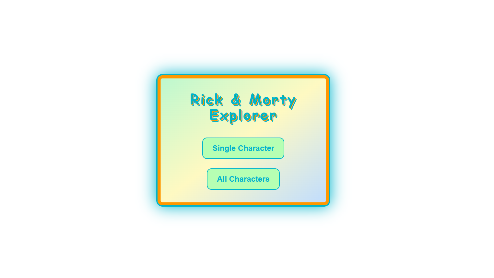

# Character GraphQL API

A simple GraphQL API for managing character data, built with Node.js, Next.js, and GraphQL.

## Table of Contents

- [Overview](#overview)
- [Screenshot](#screenshot)
- [Technologies](#technologies)
- [Getting Started](#getting-started)
- [Usage](#usage)
- [API Endpoints](#api-endpoints)
- [License](#license)
- [Credits](#credits)
- [Contact](#contact)

## Overview

This project provides a GraphQL API to create, read, update, and delete character information. It is designed for learning and demonstration purposes, following best practices for API development.

## Screenshot



## Technologies

[](https://nodejs.org/)
[](https://graphql.org/)
[](https://nextjs.org/)

## Getting Started

1. **Clone the repository:**
   ```bash
   git clone https://github.com/Mia06-coder/alx-graphql-0x00.git
   cd alx-graphql-0x00/character
   ```
2. **Install dependencies:**
   ```bash
   npm install
   ```
3. **Start the server:**
   ```bash
   npm run dev -- -p 3000
   ```

## Usage

Once the server is running, access the GraphQL playground at `http://localhost:3000` to interact with the API.

## API Endpoints

- **Query characters:**

  ```graphql
  query {
    character(id: 1) {
      id
      name
      status
      species
      type
      gender
    }
  }
  ```

- **Output JSON:**
  ```json
  {
    "data": {
      "character": {
        "id": "1",
        "name": "Rick Sanchez",
        "status": "Alive",
        "species": "Human",
        "type": "",
        "gender": "Male"
      }
    }
  }
  ```

## License

[](https://opensource.org/licenses/MIT)

## Credits

- Project idea & structure inspired by [ALX](https://www.alxafrica.com/) exercises
- GraphQL API concepts based on [GraphQL.org documentation](https://graphql.org/learn/)
- Badge assets provided by [Shields.io](https://shields.io/)
- Sample character data adapted from [Rick and Morty API](https://rickandmortyapi.com/graphql)

## Contact

Made with ❤️ by **Mia Mudzingwa**

- GitHub: [Mia06-coder](https://github.com/Mia06-coder)
- LinkedIn: [mia-mudzingwa](https://www.linkedin.com/in/mia-mudzingwa)
